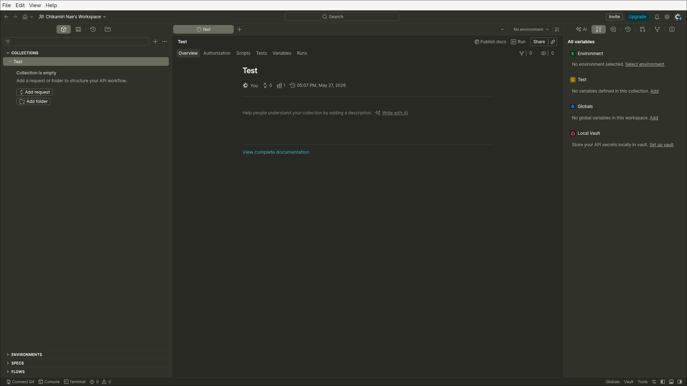
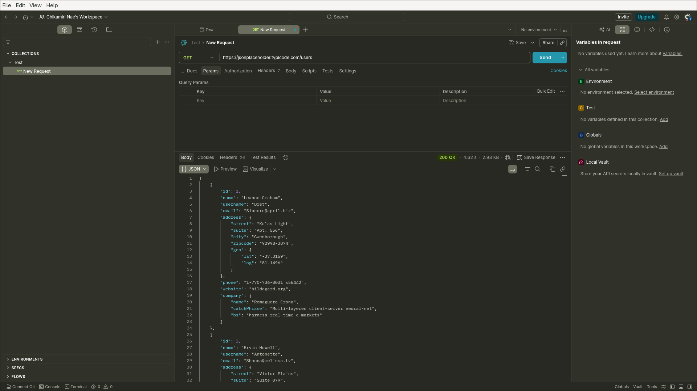
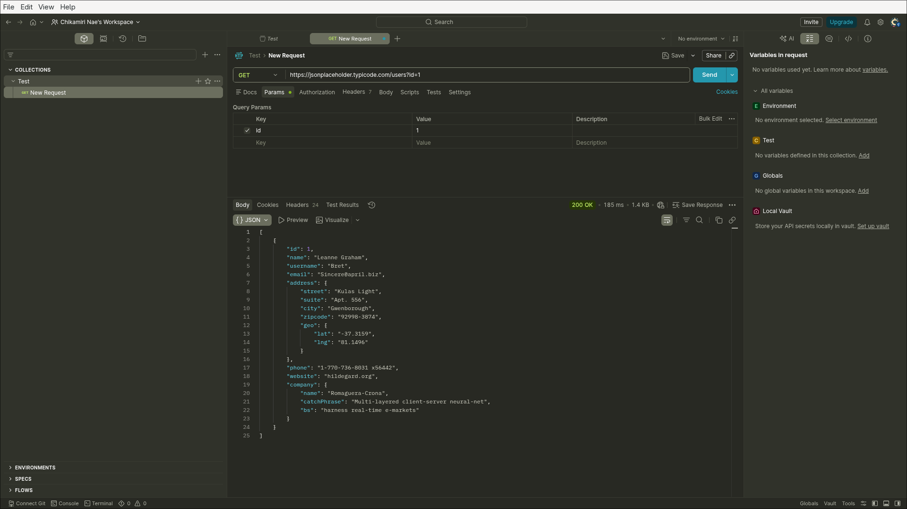
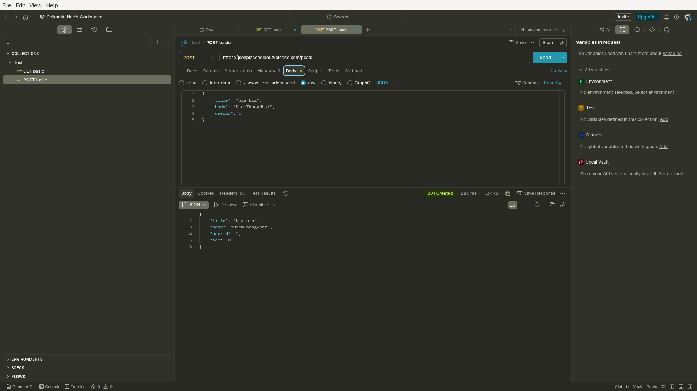
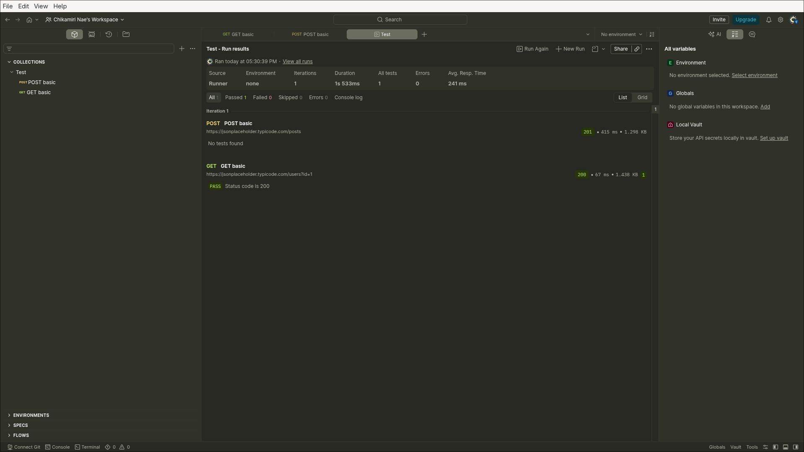

# Báo cáo kiểm thử API bằng POSTMAN

# Tài liệu tham khảo

- Video yêu cầu của đề bài: https://www.youtube.com/watch?v=MFxk5BZulVU
- Repo mẫu tham khảo cách viết báo cáo: https://github.com/gtaAsian/New-Collection-of-APIs/tree/main
- Postman Docs - Collections: https://learning.postman.com/docs/collections/collections-overview
- Postman Docs - Variables: https://learning.postman.com/docs/postman/variables-and-environments/variables/
- Postman Docs - Test scripts: https://learning.postman.com/docs/writing-scripts/test-scripts/

## 1. Mục tiêu

- Hiểu các khái niệm cơ bản của API
- Dùng Postman để request + validate response từ API public

## 2. Các bước thực hiện

- Cài nhanh

    ```bash
    # hoặc dùng flatpak
    paru -S postman-bin
    ```

- Sau khi đăng nhập và tạo collection


- Basic GET request
    URL: https://jsonplaceholder.typicode.com/users

    Phương thức: **GET**

    

- Query Parameters
    - Tại tab Params, nhập:
        - Key: `id`
        - Value: `1`

    - URL mới: https://jsonplaceholder.typicode.com/users?id=1

        

- POST Request
    - URL: https://jsonplaceholder.typicode.com/posts

    - Tab **Body**, **raw**

    ```json
    {
        "title": "bla bla",
        "body": "DiemThongNhat",
        "userId": 1
    }
    ```

    

- Test Automation
    - Using 'GET basic'
    - Tab **Scripts**, **Snippets**
    - Chooose **`Status code: Code is 200`**

    