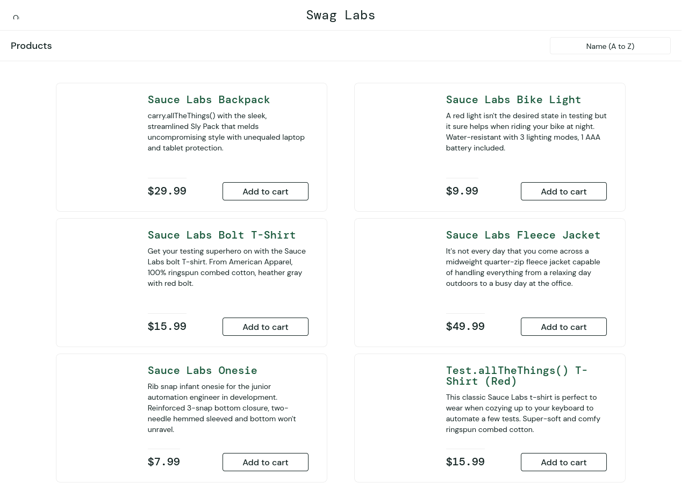
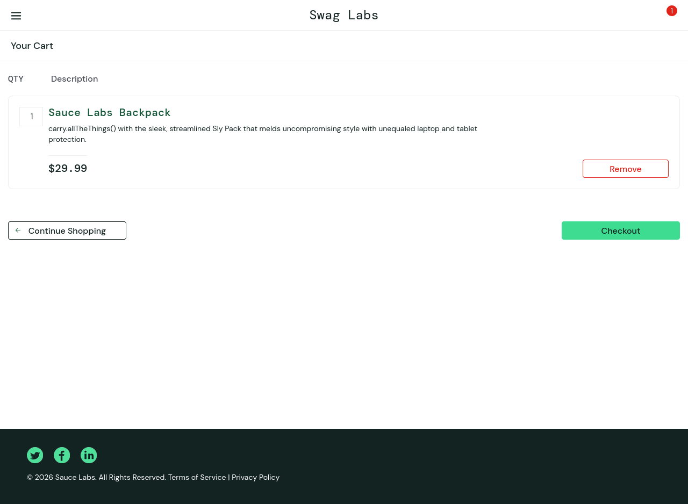
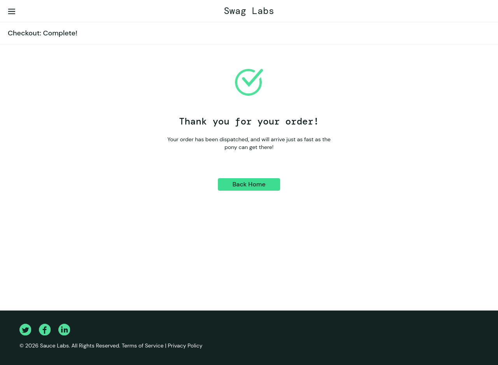
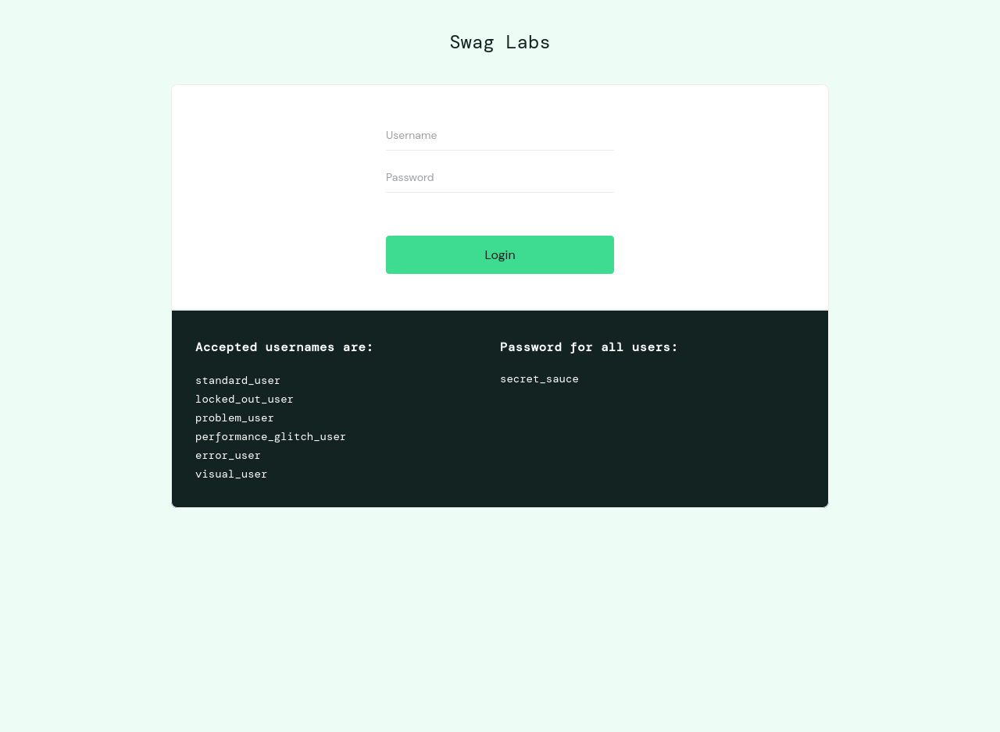

# Báo cáo kiểm thử tự động bằng Selenium

# Tài liệu tham khảo

- Website kiểm thử: [SauceDemo](https://www.saucedemo.com/)
- Selenium Documentation: [Selenium WebDriver](https://www.selenium.dev/documentation/webdriver/)
- Script kiểm thử tự động trong dự án: [selenium_test.py](file:///home/chikamiri/Downloads/software-testing/selenium_test.py)

## 1. Mục tiêu

- Sử dụng Selenium WebDriver bằng thư viện Python để xây dựng kịch bản kiểm thử tự động.
- Mô phỏng hành vi của người dùng trên trang thương mại điện tử **SauceDemo**:
  - Đăng nhập hệ thống.
  - Thêm sản phẩm vào giỏ hàng.
  - Thực hiện quy trình thanh toán (Checkout).
  - Đăng xuất khỏi hệ thống.

## 2. Kịch bản kiểm thử (Test Cases)

| ID | Tên kịch bản kiểm thử | Mô tả các bước thực hiện | Kết quả mong đợi | Trạng thái |
| :--- | :--- | :--- | :--- | :---: |
| **TC-01** | Đăng nhập thành công | 1. Truy cập `saucedemo.com`<br>2. Nhập username `standard_user`<br>3. Nhập password `secret_sauce`<br>4. Nhấp nút Login | Chuyển hướng sang trang sản phẩm `inventory.html` và hiển thị tiêu đề "Products". | **Passed** |
| **TC-02** | Thêm sản phẩm vào giỏ hàng | 1. Ở trang danh sách sản phẩm, click "Add to cart" ở sản phẩm "Sauce Labs Backpack"<br>2. Xác minh số lượng icon giỏ hàng là 1<br>3. Click vào icon giỏ hàng để chuyển sang trang `cart.html` | Chuyển hướng sang trang giỏ hàng và hiển thị đúng tên sản phẩm "Sauce Labs Backpack". | **Passed** |
| **TC-03** | Thanh toán đơn hàng (Checkout) | 1. Click nút "Checkout"<br>2. Nhập First Name, Last Name, Postal Code<br>3. Click "Continue"<br>4. Click "Finish" | Chuyển hướng sang trang hoàn thành đơn hàng `checkout-complete.html` và hiển thị thông báo "Thank you for your order!". | **Passed** |
| **TC-04** | Đăng xuất khỏi hệ thống | 1. Click vào menu góc trái (Burger menu)<br>2. Đợi menu mở ra và click "Logout" | Chuyển hướng trở về trang đăng nhập ban đầu và các trường nhập liệu được hiển thị đầy đủ. | **Passed** |

---

### Chi tiết các bước thực hiện và ảnh minh họa

#### TC-01: Đăng nhập thành công
Hệ thống xác thực tài khoản hợp lệ, chuyển hướng sang trang mua hàng.


#### TC-02: Thêm sản phẩm vào giỏ hàng
Thêm sản phẩm thành công và giỏ hàng hiển thị đúng sản phẩm đã chọn.


#### TC-03: Thanh toán đơn hàng
Hoàn tất các bước nhập thông tin nhận hàng và xác nhận đơn hàng thành công.


#### TC-04: Đăng xuất khỏi hệ thống
Người dùng đăng xuất an toàn khỏi hệ thống, đưa trình duyệt quay lại trang đăng nhập.


---

## 3.Code kiểm thử

Code được viết bằng Python kết hợp thư viện Selenium WebDriver, thực thi bằng trình duyệt Firefox chạy ở chế độ `headless`

Khi chạy kiểm thử bằng lệnh `./venv/bin/python selenium_test.py`:

```txt
Initialized Firefox WebDriver.

=== Test Case 1: Login Success ===
Saved screenshot: sel_login_success.png

=== Test Case 2: Add Product to Cart ===
Saved screenshot: sel_cart_item_added.png

=== Test Case 3: Checkout Process ===
Saved screenshot: sel_checkout_complete.png

=== Test Case 4: Logout ===
Saved screenshot: sel_logout_success.png

ALL TESTS PASSED SUCCESSFULLY!
```
